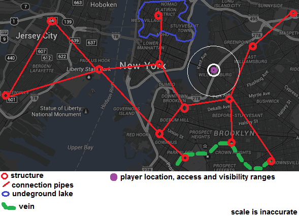

# Screens

## Gps map

Earth map. Similar to google map, used to:

* navigate player to desired location
* collect resources
* place new structures
* connect structures with pipes, wires

## Structure screen

Similar to "fallout shelter" / "terraria" base view. Content depends on player gps location. May not be available, if no buildings nearby.

Each new room level cost more in exponential scale. It is possible to build underground rooms and overground.

E.g. 2 structures could be connected with pipes.

## Chat

private/global/local/team/agency chats.

## Team overview

List of facilities and resource generation per day (hour?).

Team research and upgrades.

##Items

Does it need separate screen?

## Player specialization.

Achievements and skills.

## Scores.

For player, team, agency, global, zone, etc.